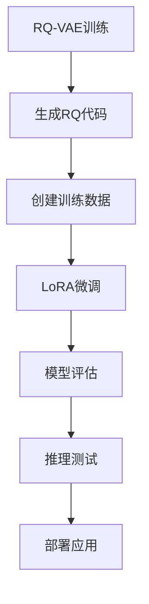

# RQ-VAE LoRA微调指南

本指南说明如何将RQ-VAE生成的token语料送入LLaMA2-7B进行LoRA微调。

## 📋 目录

- [环境准备](#环境准备)
- [数据准备](#数据准备)
- [训练流程](#训练流程)
- [推理测试](#推理测试)
- [配置说明](#配置说明)
- [故障排除](#故障排除)

## 🛠️ 环境准备

### 1. 系统要求

- Python 3.8+
- CUDA 11.0+ (推荐)
- 16GB+ GPU内存 (LLaMA2-7B)
- 50GB+ 磁盘空间

### 2. 安装依赖

```bash
# 克隆项目
cd SSQR-main/lora_training

# 运行环境设置脚本
python setup_environment.py

# 或手动安装
pip install -r requirements.txt
```

### 3. 获取模型访问权限

```bash
# 设置Hugging Face Token (用于下载LLaMA2)
huggingface-cli login

# 设置Wandb Token (用于训练监控)
wandb login
```

## 📊 数据准备

### 1. 准备RQ-VAE代码数据

确保你有以下文件：
- `codes_new/FB15K-237N_16_1024_4_rq.pt` - RQ代码文件
- `data/FB15K-237N/entity2text.txt` - 实体文本
- `data/FB15K-237N/relation2id.txt` - 关系文本
- `data/FB15K-237N/train2id.txt` - 知识图谱三元组

### 2. 生成训练数据

```bash
python dataset_generator.py
```

这将生成以下文件：
- `lora_data/train.json` - 训练数据
- `lora_data/validation.json` - 验证数据
- `lora_data/dataset_stats.json` - 数据统计

### 3. 数据格式说明

训练数据采用Alpaca格式：

```json
{
  "instruction": "### RQ-VAE Instruction:\nExplain the quantized representation of entity 'Barack Obama':\n<ENT>Barack Obama</ENT> <CODE>Q0_123:Q1_456:Q2_789|Q0_234:Q1_567:Q2_890</CODE>\n\n### Response:\n",
  "input": "",
  "output": "The quantized representation of 'Barack Obama' consists of 4 sequence positions, each with 3 quantizer levels..."
}
```

## 🚀 训练流程

### 1. 基础训练

```bash
python train_lora.py \
    --model_name meta-llama/Llama-2-7b-hf \
    --train_data lora_data/train.json \
    --val_data lora_data/validation.json \
    --output_dir lora_outputs \
    --epochs 3 \
    --batch_size 4 \
    --learning_rate 2e-4 \
    --lora_r 16 \
    --lora_alpha 32
```

### 2. 高级训练配置

```bash
python train_lora.py \
    --model_name meta-llama/Llama-2-7b-hf \
    --train_data lora_data/train.json \
    --val_data lora_data/validation.json \
    --output_dir lora_outputs \
    --epochs 5 \
    --batch_size 2 \
    --gradient_accumulation_steps 8 \
    --learning_rate 1e-4 \
    --warmup_steps 200 \
    --lora_r 32 \
    --lora_alpha 64 \
    --lora_dropout 0.05 \
    --fp16 \
    --wandb_project rq-lora-experiment
```

### 3. 训练监控

训练过程中可以通过以下方式监控：

- **Wandb**: 自动记录训练指标
- **Tensorboard**: 查看详细训练曲线
- **日志文件**: 保存在`logs/`目录

## 🧪 推理测试

### 1. 基础推理

```bash
python inference.py \
    --base_model meta-llama/Llama-2-7b-hf \
    --lora_adapter lora_outputs/lora_adapters \
    --rq_codes codes_new/FB15K-237N_16_1024_4_rq.pt \
    --entity_texts data/FB15K-237N/entity2text.txt \
    --num_samples 50 \
    --output inference_results.json
```

### 2. 自定义测试

```python
from inference import RQLoraInference
import numpy as np

# 初始化推理器
inference = RQLoraInference(
    base_model_name="meta-llama/Llama-2-7b-hf",
    lora_adapter_path="lora_outputs/lora_adapters"
)

# 测试实体理解
rq_codes = np.array([[123, 456, 789], [234, 567, 890]])
result = inference.test_entity_understanding(
    entity_name="Barack Obama",
    rq_codes=rq_codes,
    task_type="understanding"
)

print(result["response"])
```

## ⚙️ 配置说明

### LoRA参数

| 参数 | 默认值 | 说明 |
|------|--------|------|
| `lora_r` | 16 | LoRA秩，影响模型容量 |
| `lora_alpha` | 32 | LoRA缩放参数 |
| `lora_dropout` | 0.1 | LoRA dropout率 |
| `target_modules` | 全连接层 | 应用LoRA的模块 |

### 训练参数

| 参数 | 默认值 | 说明 |
|------|--------|------|
| `epochs` | 3 | 训练轮数 |
| `batch_size` | 4 | 批次大小 |
| `learning_rate` | 2e-4 | 学习率 |
| `max_length` | 512 | 最大序列长度 |
| `gradient_accumulation_steps` | 4 | 梯度累积步数 |

### 生成参数

| 参数 | 默认值 | 说明 |
|------|--------|------|
| `temperature` | 0.7 | 生成温度 |
| `top_p` | 0.9 | Top-p采样 |
| `top_k` | 50 | Top-k采样 |
| `repetition_penalty` | 1.1 | 重复惩罚 |

## 🔧 故障排除

### 常见问题

#### 1. 内存不足

**问题**: CUDA out of memory

**解决方案**:
```bash
# 减少批次大小
--batch_size 1

# 增加梯度累积
--gradient_accumulation_steps 16

# 使用8-bit训练
pip install bitsandbytes
# 在训练脚本中添加8-bit配置
```

#### 2. 模型下载失败

**问题**: 无法下载LLaMA2模型

**解决方案**:
```bash
# 设置Hugging Face Token
huggingface-cli login

# 或使用镜像
export HF_ENDPOINT=https://hf-mirror.com
```

#### 3. 训练速度慢

**问题**: 训练速度过慢

**解决方案**:
```bash
# 使用Flash Attention
pip install flash-attn

# 启用FP16
--fp16

# 使用多GPU
accelerate launch train_lora.py [参数]
```

#### 4. 生成质量差

**问题**: 模型生成质量不佳

**解决方案**:
- 增加训练数据量
- 调整LoRA参数 (`lora_r`, `lora_alpha`)
- 延长训练时间
- 调整生成参数

### 性能优化

#### 1. 内存优化

```python
# 使用梯度检查点
training_args.gradient_checkpointing = True

# 使用DeepSpeed
pip install deepspeed
```

#### 2. 速度优化

```python
# 使用编译优化
model = torch.compile(model)

# 使用混合精度
training_args.fp16 = True
```

## 📈 评估指标

### 1. 自动评估

- **代码提取准确率**: 从生成文本中提取RQ代码的准确率
- **困惑度**: 模型对测试数据的困惑度
- **BLEU分数**: 生成文本的质量评估

### 2. 人工评估

- **语义一致性**: 生成内容与RQ代码的语义一致性
- **逻辑正确性**: 推理过程的逻辑正确性
- **语言流畅性**: 生成文本的语言流畅度

## 🔄 工作流程



## 📚 参考资料

- [LoRA论文](https://arxiv.org/abs/2106.09685)
- [PEFT库文档](https://huggingface.co/docs/peft)
- [LLaMA2模型](https://huggingface.co/meta-llama/Llama-2-7b-hf)
- [RQ-VAE论文](https://arxiv.org/abs/2303.01928)

## 🤝 贡献

欢迎提交Issue和Pull Request来改进这个项目！

## 📄 许可证

本项目遵循原项目的许可证。
